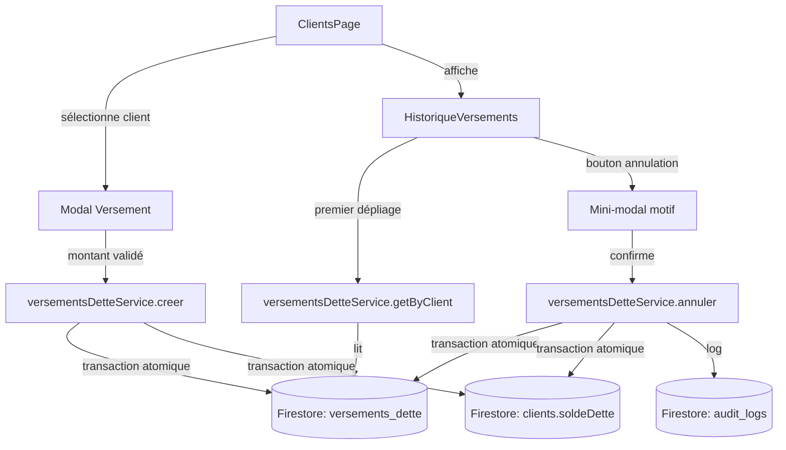

# Document de Design — Historique des versements de dette client

## Vue d'ensemble

Cette fonctionnalité introduit une traçabilité complète des versements de dette client dans l'application de gestion de stock/POS. Actuellement, `clientsService.payerDette` soustrait directement le `soldeDette` sans créer de document persistant, ce qui rend toute correction ou audit impossible.

La solution ajoute :
1. Un **type TypeScript `VersementDette`** dans `types/index.ts`
2. Un **service `versementsDetteService`** dans `lib/db.ts` avec transactions atomiques
3. La **refactorisation de `clientsService.payerDette`** pour déléguer au nouveau service
4. Un **composant `HistoriqueVersements`** pliable avec mini-modal d'annulation intégré
5. L'**intégration dans `app/clients/page.tsx`** sous les boutons d'action existants

---

## Architecture

### Flux de données



### Séparation des responsabilités

- **`versementsDetteService`** (lib/db.ts) : toute la logique Firestore, transactions, audit
- **`HistoriqueVersements`** (components/modules) : affichage et interaction UI uniquement
- **`ClientsPage`** (app/clients) : orchestration, appels au service, mise à jour d'état local

---

## Composants et Interfaces

### 1. Service `versementsDetteService`

```typescript
interface VersementsDetteService {
  creer(
    clientId: string,
    clientNom: string,
    montant: number,
    utilisateur: { uid: string; nom: string },
    magasinId: string | null
  ): Promise<string>; // retourne l'ID du versement créé

  getByClient(
    clientId: string,
    magasinId?: string | null,
    limitN?: number
  ): Promise<VersementDette[]>;

  annuler(
    versementId: string,
    clientId: string,
    motif: string,
    utilisateur: { uid: string; nom: string; role: string },
    magasinId: string | null
  ): Promise<void>;
}
```

### 2. Composant `HistoriqueVersements`

```typescript
interface HistoriqueVersementsProps {
  client: Client;
  utilisateur: { uid: string; nom: string; role: string };
  magasinId: string | null;
  onSoldeUpdate: (clientId: string, nouveauSolde: number) => void;
}
```

**État interne :**
- `ouvert: boolean` — état du panneau pliable
- `versements: VersementDette[]` — liste chargée lazily
- `chargement: boolean` — spinner au premier dépliage
- `chargé: boolean` — flag pour éviter un rechargement au repliage/dépliage ultérieur
- `versementAnnuler: VersementDette | null` — versement sélectionné pour annulation
- `motifAnnulation: string` — valeur du textarea dans le mini-modal
- `annulationEnCours: boolean` — état du bouton de confirmation

### 3. Refactorisation de `clientsService.payerDette`

La méthode actuelle est remplacée par un appel direct à `versementsDetteService.creer`. La signature publique reste identique pour ne pas casser `app/clients/page.tsx`.

```typescript
// Avant (lib/db.ts)
async payerDette(clientId: string, montant: number): Promise<void>

// Après : délègue à versementsDetteService
async payerDette(
  clientId: string,
  montant: number,
  utilisateur: { uid: string; nom: string },
  magasinId: string | null,
  clientNom?: string
): Promise<void>
```

> **Décision de design** : On étend la signature plutôt que de supprimer la méthode, ce qui évite un refactoring systématique de tous les appelants. L'appelant dans `ClientsPage` sera mis à jour pour passer `appUser` et `clientNom`.

---

## Modèles de données

### Type TypeScript `VersementDette`

```typescript
// types/index.ts
export interface VersementDette {
  id: string;
  clientId: string;
  clientNom: string;
  montant: number;
  utilisateurId: string;
  utilisateurNom: string;
  magasinId: string | null;
  statut: "actif" | "annulé";
  // Champs présents uniquement si statut == "annulé"
  annuléParId?: string;
  annuléParNom?: string;
  annuléMotif?: string;
  annuléAt?: Date;
  createdAt: Date;
}
```

### Collection Firestore `versements_dette`

| Champ | Type | Description |
|---|---|---|
| `clientId` | `string` | Référence au document client |
| `clientNom` | `string` | Nom dénormalisé pour l'affichage |
| `montant` | `number` | Montant du versement en F |
| `utilisateurId` | `string` | UID de l'utilisateur qui a créé le versement |
| `utilisateurNom` | `string` | Nom dénormalisé |
| `magasinId` | `string \| null` | Isolation multi-magasin |
| `statut` | `"actif" \| "annulé"` | État courant du versement |
| `annuléParId` | `string?` | UID de l'annulateur |
| `annuléParNom` | `string?` | Nom de l'annulateur |
| `annuléMotif` | `string?` | Motif de l'annulation |
| `annuléAt` | `Timestamp?` | Horodatage de l'annulation |
| `createdAt` | `Timestamp` | Horodatage de création |

### Index Firestore nécessaires

```json
// firestore.indexes.json — à ajouter
{
  "collectionGroup": "versements_dette",
  "queryScope": "COLLECTION",
  "fields": [
    { "fieldPath": "clientId", "order": "ASCENDING" },
    { "fieldPath": "magasinId", "order": "ASCENDING" },
    { "fieldPath": "createdAt", "order": "DESCENDING" }
  ]
}
```

### Ajout dans `COLS` (lib/db.ts)

```typescript
const COLS = {
  // ... existants ...
  versementsDette: "versements_dette",
};
```

---

## Propriétés de Correction

*Une propriété est une caractéristique ou un comportement qui doit rester vrai pour toutes les exécutions valides du système — essentiellement, une déclaration formelle de ce que le système est censé faire. Les propriétés servent de pont entre les spécifications lisibles par l'humain et les garanties de correction vérifiables automatiquement.*

### Propriété 1 : Création d'un versement — round-trip et mise à jour du solde

*Pour tout* client avec un `soldeDette` initial D et tout montant valide M (0 < M ≤ D), après appel à `versementsDetteService.creer(clientId, ..., M, ...)` :
- `getByClient(clientId)` retourne un versement avec `montant == M` et `statut == "actif"`
- Le `soldeDette` du client est égal à D - M

**Valide : Exigences 1.1, 1.2**

---

### Propriété 2 : Rejet des montants invalides

*Pour tout* montant M ≤ 0, `versementsDetteService.creer()` doit lancer une erreur explicite sans modifier le `soldeDette` ni créer de document dans `versements_dette`.

*Pour tout* client avec soldeDette D et tout montant M > D, `versementsDetteService.creer()` doit lancer une erreur explicite.

**Valide : Exigences 1.4, 1.5**

---

### Propriété 3 : Tri et limite de `getByClient`

*Pour tout* ensemble de versements d'un client, `getByClient()` les retourne triés par `createdAt` décroissant.

*Pour tout* client ayant plus de 10 versements, `getByClient()` sans paramètre `limit` retourne exactement 10 versements.

**Valide : Exigences 2.1, 2.2**

---

### Propriété 4 : Annulation — invariant de solde et completude des champs

*Pour tout* versement actif de montant M sur un client avec soldeDette D, après appel à `versementsDetteService.annuler()` par un Utilisateur_Autorisé :
- Le statut du versement est `"annulé"`
- Le `soldeDette` du client est égal à D + M
- Le document versement contient les champs `annuléParId`, `annuléParNom`, `annuléMotif`, `annuléAt`

**Valide : Exigences 3.1, 3.2**

---

### Propriété 5 : Idempotence — double annulation rejetée

*Pour tout* versement dont le statut est déjà `"annulé"`, tout appel à `versementsDetteService.annuler()` doit lancer une erreur explicite sans modifier le `soldeDette`.

**Valide : Exigence 3.4**

---

### Propriété 6 : Contrôle d'accès à l'annulation

*Pour tout* utilisateur avec le rôle `vendeur` et tout versement (quelle que soit sa valeur), `versementsDetteService.annuler()` doit lancer une erreur d'autorisation.

**Valide : Exigence 3.5**

---

### Propriété 7 : Affichage conditionnel des boutons d'annulation

*Pour tout* liste de versements rendue avec un utilisateur de rôle `admin` ou `gestionnaire`, chaque versement de statut `actif` doit avoir un bouton d'annulation visible.

*Pour tout* liste de versements rendue avec un utilisateur de rôle `vendeur`, aucun bouton d'annulation ne doit être visible.

**Valide : Exigences 4.1, 4.5**

---

### Propriété 8 : Validation du motif d'annulation

*Pour toute* chaîne composée uniquement d'espaces (ou chaîne vide), la soumission du formulaire d'annulation doit être bloquée avec un message d'erreur visible.

**Valide : Exigence 4.3**

---

### Propriété 9 : Déclencheur conditionnel selon le solde et l'historique

*Pour tout* client avec `soldeDette ≤ 0` et aucun versement, le déclencheur de la section HistoriqueVersements ne doit pas être rendu.

*Pour tout* client avec `soldeDette > 0` OU au moins un versement, le déclencheur doit être rendu.

**Valide : Exigence 5.3**

---

### Propriété 10 : Isolation multi-magasin

*Pour tout* deux ensembles de versements appartenant à deux `magasinId` distincts A et B, `getByClient(clientId, magasinIdA)` ne doit retourner aucun versement appartenant au magasin B.

**Valide : Exigence 6.4**

---

## Gestion des erreurs

### Erreurs du service

| Situation | Message d'erreur | Comportement |
|---|---|---|
| `montant <= 0` | `"Le montant doit être supérieur à zéro"` | Rejeter avant transaction |
| `montant > soldeDette` | `"Le montant dépasse le solde de dette"` | Rejeter dans transaction |
| Client introuvable | `"Client introuvable"` | Lancé dans transaction |
| Versement introuvable | `"Versement introuvable"` | Lancé dans transaction |
| Versement déjà annulé | `"Ce versement est déjà annulé"` | Rejeter dans transaction |
| Rôle insuffisant | `"Accès refusé : rôle insuffisant"` | Rejeter avant transaction |
| Échec transaction Firestore | Erreur native Firestore propagée | Aucune mutation partielle |

### Gestion UI

- Toutes les erreurs service sont capturées dans le composant et affichées via `react-hot-toast`
- Le spinner de chargement est affiché pendant les opérations asynchrones
- Les boutons sont désactivés (`disabled`) pendant les opérations en cours
- Le chargement initial de l'historique affiche un indicateur de spinner
- En cas d'erreur de chargement de l'historique, un message d'erreur inline est affiché (pas de toast)

### État vide

- Si aucun versement n'est trouvé après chargement : message "Aucun versement enregistré pour ce client."
- Si le client n'a pas de dette et aucun versement : le déclencheur est masqué (section non accessible)

---

## Stratégie de test

### Tests unitaires (exemples spécifiques)

- Vérifier que `getByClient` avec 0 versement retourne `[]`
- Vérifier l'affichage de l'état vide dans `HistoriqueVersements`
- Vérifier que le panneau se plie/déplie au clic sur le chevron
- Vérifier que le chargement lazy n'est déclenché qu'au premier dépliage
- Vérifier que le modal d'annulation s'ouvre au clic sur le bouton d'annulation
- Vérifier que `onSoldeUpdate` est appelé après une annulation réussie

### Tests de propriété (property-based testing)

La librairie choisie est **fast-check** (TypeScript), configurée pour un minimum de 100 itérations par test.

Chaque test de propriété référence la propriété correspondante dans ce document avec le tag :
**Feature: versements-dette-historique, Property {N}: {texte}**

- **Propriété 1** : Générer des `(soldeDette, montant)` valides, appeler `creer()`, vérifier round-trip
- **Propriété 2** : Générer des montants invalides (≤ 0, > soldeDette), vérifier rejet
- **Propriété 3** : Générer des listes de versements avec dates aléatoires, vérifier tri décroissant et limite de 10
- **Propriété 4** : Générer des versements actifs avec montants aléatoires, vérifier invariant de solde et complétude des champs après annulation
- **Propriété 5** : Générer des versements annulés, vérifier rejet de double annulation
- **Propriété 6** : Générer des utilisateurs vendeur, vérifier rejet systématique de l'annulation
- **Propriété 7** : Générer des listes de versements avec rôles admin/gestionnaire/vendeur, vérifier présence/absence des boutons
- **Propriété 8** : Générer des chaînes composées uniquement de whitespace, vérifier blocage de soumission
- **Propriété 9** : Générer des clients avec soldeDette ≤ 0 et 0 versements, vérifier absence du déclencheur
- **Propriété 10** : Générer deux jeux de versements avec magasinIds différents, vérifier isolation

### Tests d'intégration

- Création d'un versement et vérification dans Firestore (avec émulateur Firebase)
- Annulation d'un versement et vérification de l'audit log dans Firestore
- Vérification de l'atomicité en simulant un échec de transaction (6.2, 6.3)
- Vérification que l'audit log est créé avec l'action `"VERSEMENT_DETTE_ANNULE"` (3.3)
